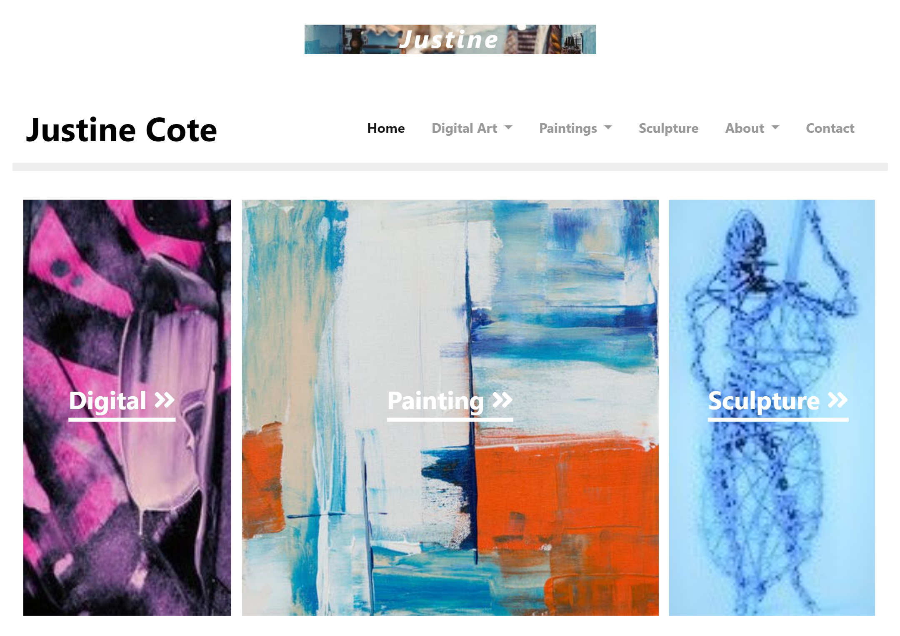
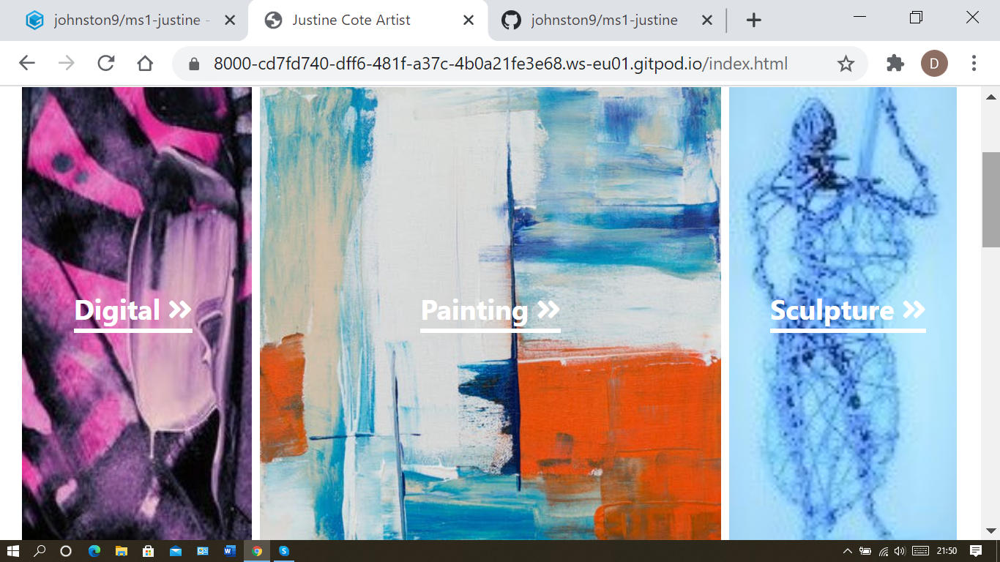
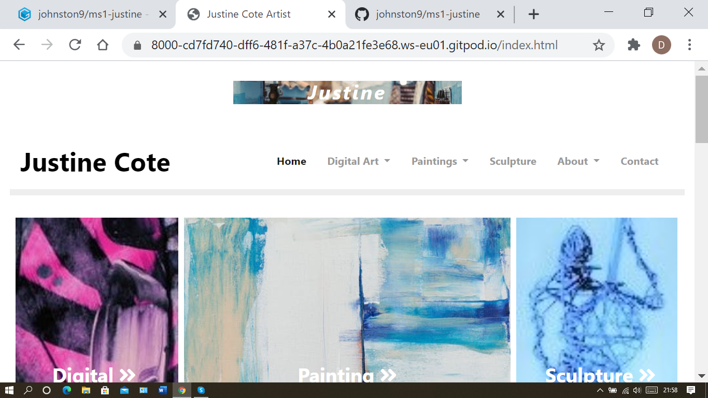
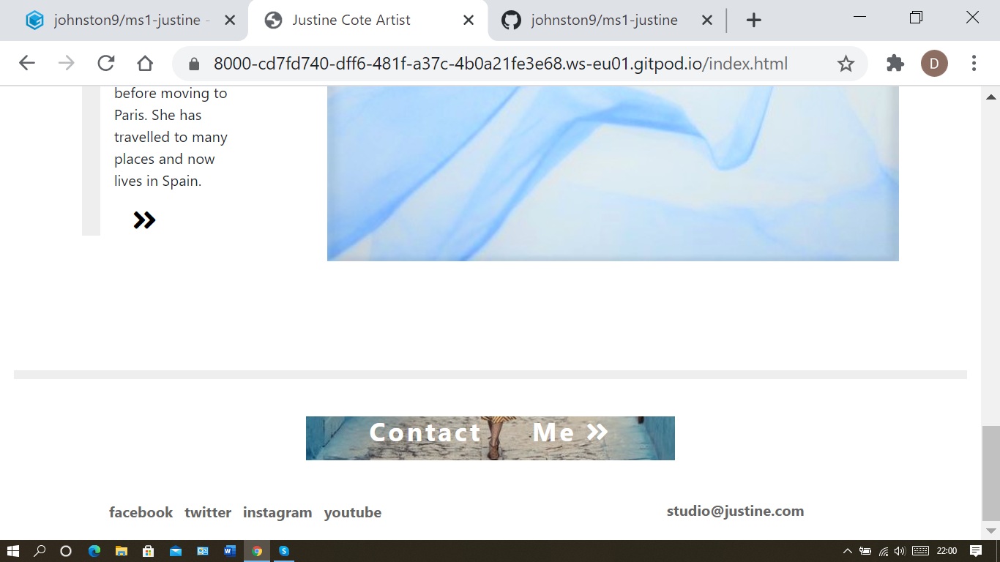
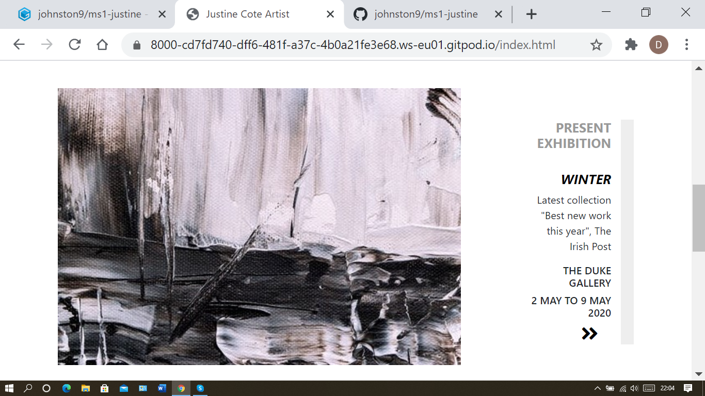
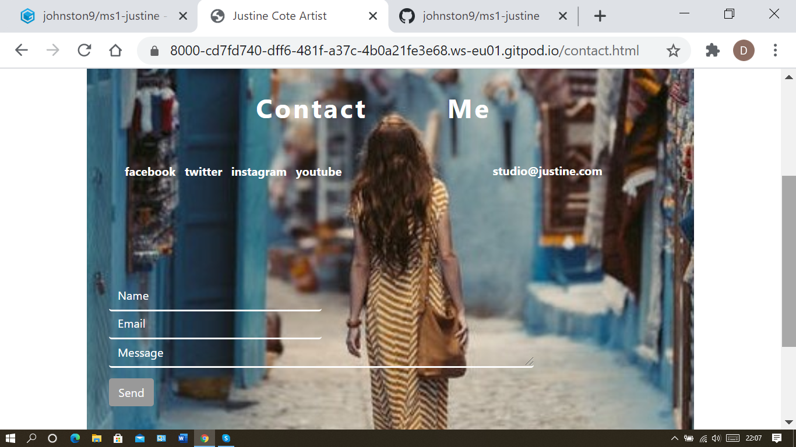
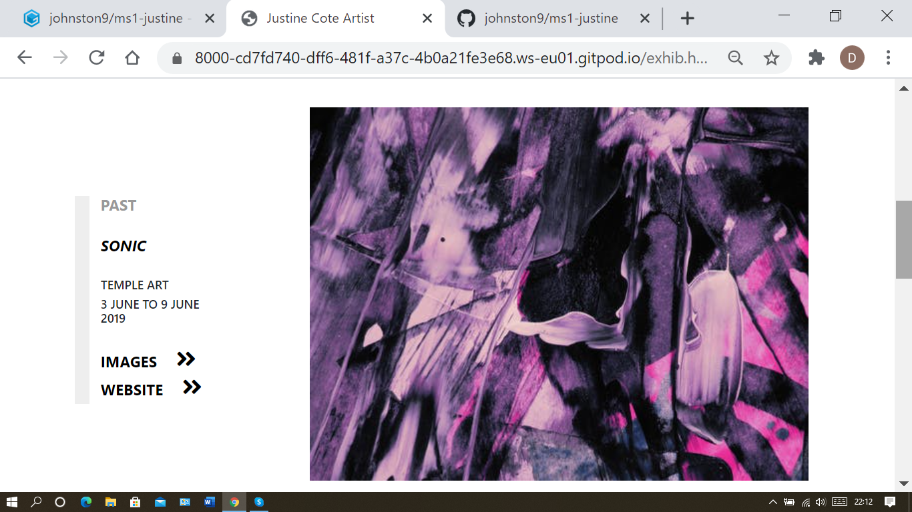
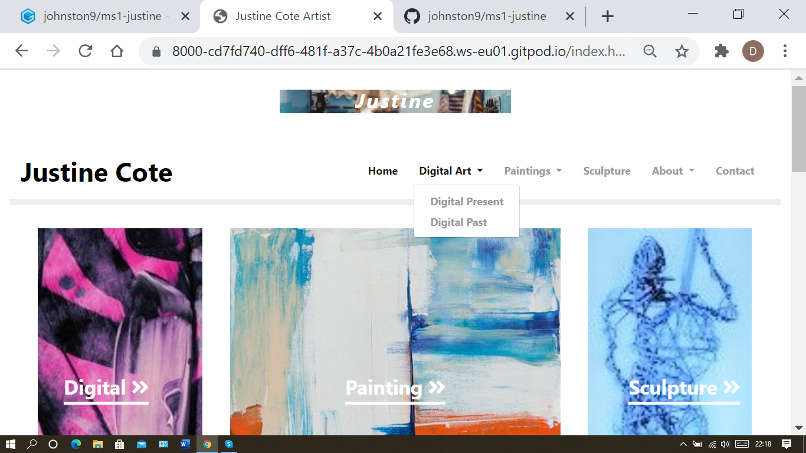
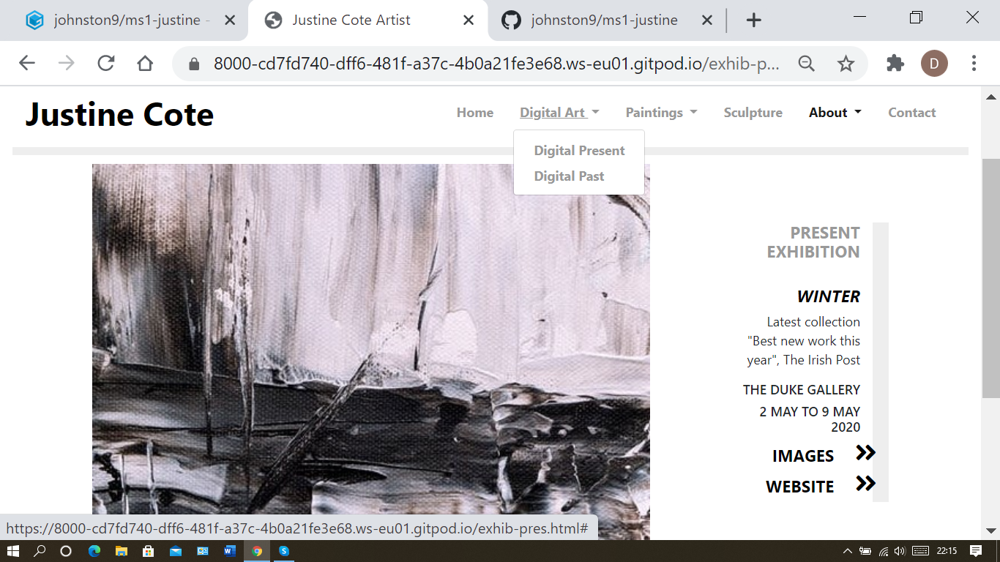
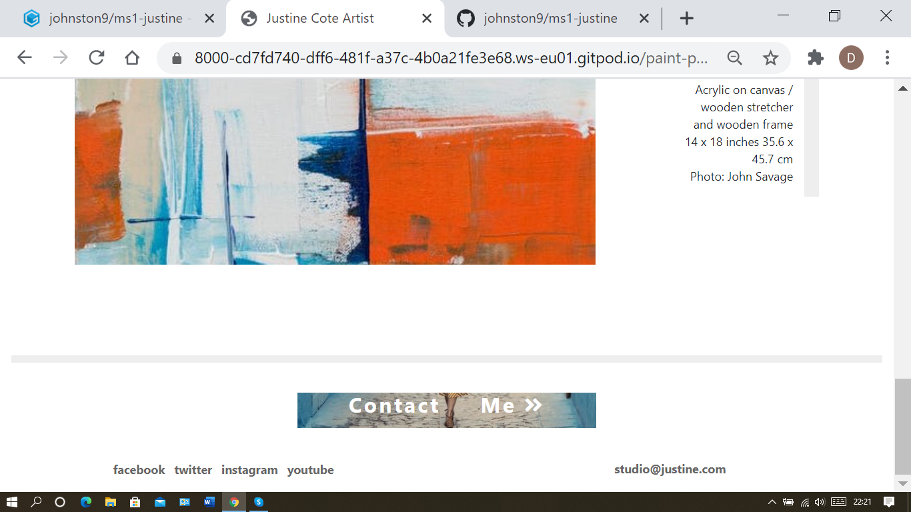

<h1 align="center">Justine Cote Website</h1>

[View the project live here.](https://johnston9.github.io/ms1-justine/)

This is the website for the artist Justine Cote. It is designed to show her work, past and present in digital art, painting and sculpture. It also advertises her latest exhibition and shows her past exhibitions and placements. It has a contact page and is also intended as a glimpse into the artist's world.

<h2 align="center"></h2>

## User Experience (UX)

This site is intended for people interested in finding out about the artist and her work.

The business goals are for the artist to find potential buyers for her work and create potential markets both in Ireland and abroad. It is also intended as a means for her to gain recognition, promote herself and establish herself in the art world. It has a professional artistic design yet at the same time has a warm open feel to invite people to get to know her better.

- ### User stories

  - #### First Time Visitor Goals

1. As a First Time Visitor, I want to find out about the artist and her work. I want to understand what type of art works she creates and find out where I can see them. I want to find out about who she is, where she comes from and lives and where she studied. I want to evaluate her work and find out how to purchase it.
2. As a First Time Visitor, I want to be able to easily navigate throughout the site to find content.
3. As a First Time Visitor, I want to locate her social media links to see her followings on social media.


    -   #### Returning Visitor Goals

1. As a Returning Visitor, I want to I want to examine her works again with a view to purchasing.
2. As a Returning Visitor, I want to find the best way to get in contact with her.
3. As a Returning Visitor, I want to re-examine past exhibitions and notable placements. I want to find out about any new exhibitions and works.


    -   #### Frequent User Goals

1. As a Frequent User, I want to check to see if she has any new works.
2. As a Frequent User, I want to check to see if there are any new exhibitions or developments.
3. As a Frequent User, I want to contact her.

- ### Design

  - #### Colour Scheme
    - The images of the art works will be the color for the site. Additional coloring will be avoided so as not to take from them. Apart from a colored logo on top with a matching color image as the footer. These will have a warm feel to them to personalise the site.
  - #### Typography
    - Clear standard from browser basic as text will not be a style element.
  - #### Imagery
    - The photos of the art works will be the backbone of the site and to all intensive purposes showing them is it's main goal.

* ### Wireframes

  - PDF – MS1- Justine Cote Artist created in Balsamic for Home, Contact, About sections (Exhibitions and Justine), Present Exhibition and the five gallery pages, Past and Present pages for both Painting and Digital and one Sculpture page.
    All pages wireframed in large, medium and small format.

- [View on Github](https://github.com/johnston9/ms1-justine/)

## Features

### Existing Features

- The site is responsive to all sizes and the images remain whole and in proportion at all sizes.

## Technologies Used

### Languages Used

- [HTML5](https://en.wikipedia.org/wiki/HTML5)
- [CSS3](https://en.wikipedia.org/wiki/Cascading_Style_Sheets)

### Frameworks, Libraries & Programs Used

1. [Bootstrap 4.4.1:](https://getbootstrap.com/docs/4.4/getting-started/introduction/)

   - Bootstrap was used to assist with the responsiveness and styling of the website.

1. [Google Fonts:](https://fonts.google.com/)
   - Google fonts were used to import the 'Roboto' font into the style.css file which were used on initial veraions but the ndiscarded.
1. [Font Awesome:](https://fontawesome.com/)
   - Font Awesome was used on all pages throughout the website for the arrow navigation icons.
1. [jQuery:](https://jquery.com/)
   - jQuery came with Bootstrap to make the navbar responsive.
1. [Git](https://git-scm.com/)
   - Git was used for version control by utilizing the Gitpod terminal to commit to Git and Push to GitHub.
1. [GitHub:](https://github.com/)
   - GitHub is used to store the projects code after being pushed from Git.
1. [Balsamiq:](https://balsamiq.com/)
   - Balsamiq was used to create the [wireframes](https://github.com/) during the design process.
1. [Favicon-generator](https://www.favicon-generator.org/)
   - Favicon-generator was used to create the favicon link.
1. [Freeformatter](https://www.freeformatter.com/html-formatter.html)
   - Freeformatter was used to tidy up the final code.
1. [Gauger](https://gauger.io/fonticon/)

   - Gauger was used to create the favicon icon.

## Testing

The W3C Markup Validator and W3C CSS Validator Services were used to validate every page of the project to ensure there were no syntax errors in the project.

- [W3C Markup Validator](https://validator.w3.org/) - [Results](https://github.com/johnston9/ms1-justine/)
- [W3C CSS Validator](https://jigsaw.w3.org/css-validator/#validate_by_input) - [Results](https://github.com/johnston9/ms1-justine/)

  (W3C CSS Validator gave an error message for type="email" being used in the message section of the contact form but I had to put it back in as it was needed to override inherited settings in the text box.)

### Testing User Stories from User Experience (UX) Section

- #### First Time Visitor Goals

  1.  As a First Time Visitor, I want to find out about the artist and her work. I want to understand what type of art works she creates and find out where I can see them live. I want to find out about who she is, where she comes from and lives and where she studied. I want to evaluate her work and find out how to purchase it.

      1.  Upon entering the site, users are automatically greeted with images of the three main areas of work she does and easily recocnisable links to get straight to galleries of these works.
      2.  On the main page the visited is also greeted with a section on her latest showing where they can view her work live.
      3.  The user is also shown a section about the artist on the main page and a clickable link to find out more.
      4.  The footer has a "Contact Me" display with a link to a contact page where they can get in touch with her if they want to ask about buying her work. Also in the about section in exhibitions they can find out about galleries where her work is for sale.

<p align="center">

</p>

2.  As a First Time Visitor, I want to be able to easily be able to navigate throughout the site to find content.

    1.  The site has been designed to be fluid and allow the user to explore her different styles of art always able to easily get back to the home page. At the top of each page there is a clean navigation bar guiding the user to the different sections.
    2.  The images and arrow icons help and encourage the use explore the site.
    3.  The Contact page has a friendly appeal and it is easy to use.

<p align="center">

</p>

3.  As a First Time Visitor, I want to locate her social media links to see her followings on social media and find out her standing in the art world.
    1.  The user will see cleary on the bottom of any page on the site the social media links in the footer.
    2.  The user will find links to galleries she shows in, locations where she has art placements, past and present exhibitions in the about section and a quote from a review in the paper on the landing page.

<p align="center">

</p>

- #### Returning Visitor Goals

1. As a Returning Visitor, I want to I want to examine her works again with a view to purchasing.

   1. They will find the current exhibition on the landing page and links to galleries where her work is for sale in the about section which is clearly shown in the navigation bar.
   2. There is also a link to the contact page in the nav bar and a large "Contact Me" link in the footer.

<p align="center">

</p>

2. As a Returning Visitor, I want to find the best way to get in contact with the organisation with any questions I may have.

   1. The navigation bar clearly highlights the "Contact Us" Page.
   2. Here they can fill out the form on the page or use the email displayed there.
   3. The footer contains another link to the contact page as well as links to Facebook, Twitter and Instagram and her email.
   4. All off site links they click, it will be open up in a new tab to ensure the user can easily get back to the website.

<p align="center">

</p>

3. As a Returning Visitor, I want to re-examine past exhibitions and notable placements. I want to find out about any new exhibitions and works.
   1. The about link in the navigation bar will take them to all notable past exhibitions and placements and include images and links to the the actual events and locations.
   2. Any current exhibition will be updated on the landing page where the current one is presently.
   3. The present Painting and Digital Art as well as the sculpture will be updated whenever she has new works to show.

<p align="center">

</p>

#### Frequent User Goals

1. As a Frequent User, I want to check to see if she has any new works.

   1. The user would already be comfortable with the website layout and can easily locate where they are displayed.

<p align="center">

</p>

2. As a Frequent User, I want to check to see if there are any new exhibitions or developments.

   1. The user would already be comfortable with the website layout and can easily locate them and check in the present exhibition section for any new shows.

<p align="center">

</p>

3. As a Frequent User, I want to contact her.
   1. The user would already be comfortable with the website layout and can easily locate the contact details.

<p align="center">

</p>

### Further Testing

- The Website was tested on Google Chrome, Internet Explorer, and Safari browsers.
- The website was viewed on a variety of devices such as Desktop, Laptop, iPhone and various other smartphones.
- A large amount of testing was done to ensure that all pages were linking correctly.
- Friends and family members were asked to review the site and to point out any bugs and/or user experience issues. These were taken on board and changes were made if necessary or to give a better user experience.

### Known Bugs

- The links on the showcase section underline blue.
- Action and it's href were left out in the form so as not to cause problems.

## Deployment

### GitHub Pages

The project was deployed to GitHub Pages using the following steps...

1. Log in to GitHub and locate the [GitHub Repository](https://github.com/)
2. At the top of the Repository (not top of page), locate the "Settings" Button on the menu.
   - Alternatively Click [Here](https://raw.githubusercontent.com/) for a GIF demonstrating the process starting from Step 2.
3. Scroll down the Settings page until you locate the "GitHub Pages" Section.
4. Under "Source", click the dropdown called "None" and select "Master Branch".
5. The page will automatically refresh.
6. Scroll back down through the page to locate the now published site [link](https://github.com) in the "GitHub Pages" section.

### Forking the GitHub Repository

By forking the GitHub Repository we make a copy of the original repository on our GitHub account to view and/or make changes without affecting the original repository by using the following steps...

1. Log in to GitHub and locate the [GitHub Repository](https://github.com/)
2. At the top of the Repository (not top of page) just above the "Settings" Button on the menu, locate the "Fork" Button.
3. You should now have a copy of the original repository in your GitHub account.

### Making a Local Clone

1. Log in to GitHub and locate the [GitHub Repository](https://github.com/)
2. Under the repository name, click "Clone or download".
3. To clone the repository using HTTPS, under "Clone with HTTPS", copy the link.
4. Open Git Bash
5. Change the current working directory to the location where you want the cloned directory to be made.
6. Type `git clone`, and then paste the URL you copied in Step 3.

```
$ git clone https://github.com/YOUR-USERNAME/YOUR-REPOSITORY
```

7. Press Enter. Your local clone will be created.

```
$ git clone https://github.com/YOUR-USERNAME/YOUR-REPOSITORY
> Cloning into `CI-Clone`...
> remote: Counting objects: 10, done.
> remote: Compressing objects: 100% (8/8), done.
> remove: Total 10 (delta 1), reused 10 (delta 1)
> Unpacking objects: 100% (10/10), done.
```

Click [Here](https://help.github.com/en/github/creating-cloning-and-archiving-repositories/cloning-a-repository#cloning-a-repository-to-github-desktop) to retrieve pictures for some of the buttons and more detailed explanations of the above process.

## Credits

### Code

- [W3schools.com](https://www.w3schools.com/howto/howto_css_placeholder.asp): Used for styling the placeholder color in the Contact page.

- [stackoverflow](https://stackoverflow.com/questions/48483925/how-to-remove-outline-in-bootstrap-4/48484022): Used to style input bow in Contact page.

- [Bootstrap4](https://getbootstrap.com/docs/4.4/getting-started/introduction/): Bootstrap Library used throughout the project mainly to make site responsive using the Bootstrap Grid System.

-

### Content

- I used lechien73 aka Matt Rudge's README for the Code Institute for the template for my README. I used his form content changing it to apply to this project.
  [view](https://github.com/Code-Institute-Solutions/SampleREADME#code-institute-website)

* All other content was written by the developer.

### Media 

- The photos used in this site were obtained from

  1.  [unsplash.com](https://unsplash.com/wallpapers/art)

  2.  [pexels.com](https://www.pexels.com/search/art/)

### Acknowledgements

- I would like to thank my mentor Aaron Sinnott for his guidence and clarity. I would also like to thank the tutor team for their insights.
